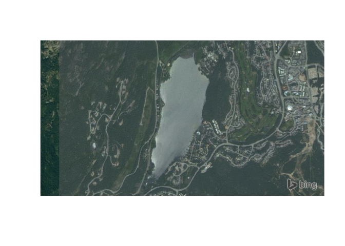
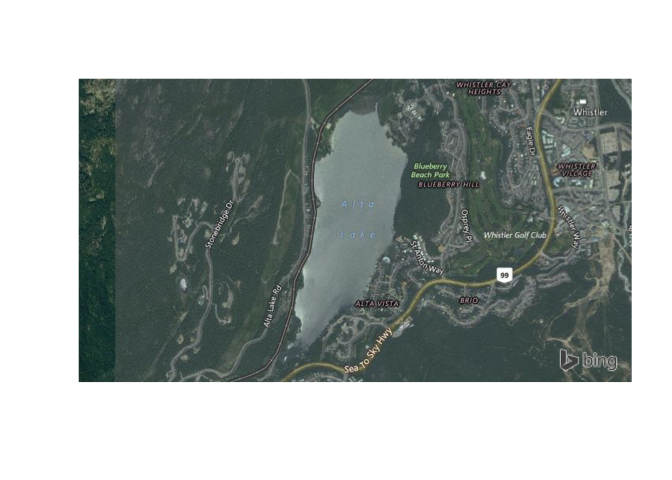
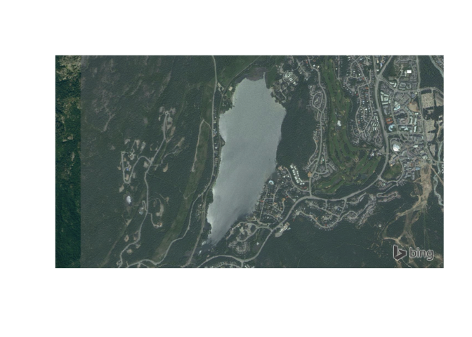
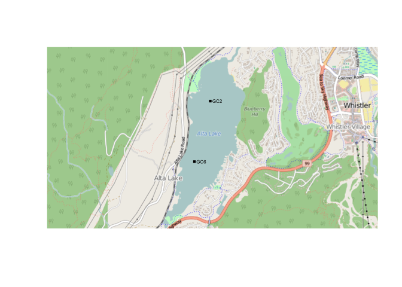
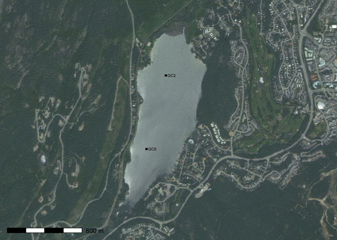

ROSM: Open Street Map tiles in R
================================

[](https://cran.r-project.org/package=rosm)

Download and plot [Open Street Map](http://www.openstreetmap.org/), [Mapquest](http://www.mapquest.com/), [Bing Maps](http://www.bing.com/maps) and other tiled map sources in a way that works seamlessly with plotting from the 'sp' package. Use to create high-resolution basemaps and add hillshade to vector based maps.

Installation
------------

The {rosm} package is [available on CRAN](https://cran.r-project.org/package=rosm), and can be installed using `install.packages("rosm")`.

Using {rosm} to plot basemaps
-----------------------------

The {rosm} package pulls [Bing Maps](https://www.bing.com/maps/), [Open Street Map](https://www.openstreetmap.org/), and [related maps](http://wiki.openstreetmap.org/wiki/Tile_servers) from the internet, caches them locally, and renders them to provide context to overlying data (your sample sites, etc.). For details, take a look at the [{rosm} manual](https://cran.r-project.org/web/packages/rosm/rosm.pdf). First we'll load the packages (we'll also be using the [prettymapr](http://paleolimbot.github.io/prettymapr) package to help us with bounding boxes and plotting.)

``` r
library(rosm)
library(prettymapr)
```

### Step 1: Find your bounding box

The {rosm} package plots based on a **bounding box**, or an area that you would like to be visible. There's a few ways to go about doing this, but the easiest way is to visit the [Open Street Maps Export page](http://www.openstreetmap.org/export), zoom to your area of interest, and copy/paste the values into `makebbox(northlat, eastlon, southlat, westlon)` from the {prettymapr} package. You can also use `searchbbox("my location name")`, also from the {prettymapr} package, which will query google for an appropriate bounding box. You'll notice that the bounding box returned by these methods is just a 2x2 matrix, the same as that returned by `bbox()` in the {sp} package.

``` r
altalake <- searchbbox("alta lake, BC")
# or
altalake <- makebbox(50.1232, -122.9574, 50.1035, -123.0042)
```

Make sure you've got your bounding box right by trying `osm.plot()` or `bmaps.plot()` with the bounding box as your first argument.

``` r
osm.plot(altalake)
```


``` r
bmaps.plot(altalake)
```



### Step 2: Choose your map type and zoom level

{rosm} provides access to a number of map types (and even the ability to load your own if you're savvy!), but the most common ones you'll use are `type=osm`, `type="hillshade"`, `type=stamenwatercolor`, and `type=stamenbw` for `osm.plot()` and `type="Aerial"` with `bmaps.plot()`. Look at all of them with `osm.types()` and `bmaps.types()`.

``` r
osm.types()
```

    ##  [1] "osm"                    "opencycle"             
    ##  [3] "hotstyle"               "loviniahike"           
    ##  [5] "loviniacycle"           "hikebike"              
    ##  [7] "hillshade"              "osmgrayscale"          
    ##  [9] "stamenbw"               "stamenwatercolor"      
    ## [11] "osmtransport"           "thunderforestlandscape"
    ## [13] "thunderforestoutdoors"  "cartodark"             
    ## [15] "cartolight"

``` r
osm.plot(altalake, type="stamenbw")
```


``` r
bmaps.types()
```

    ## [1] "Aerial"           "AerialWithLabels" "Road"

``` r
bmaps.plot(altalake, type="AerialWithLabels")
```



The next thing we'll adjust is the zoom level. The zoom level (level of detail) is calculated automatically, but it may be that you're looking for higher (or lower) resolution. To specify a resolution specifically, use `res=300` (where 300 is the resolution in dpi; useful when exporting figures), or `zoomin=1`, which will use the automatically specified zoom level and zoom in 1 more.

``` r
bmaps.plot(altalake, zoomin=1) # res=300 will also work
```



### Step 3: Add overlays

Next we'll use the `lines()`, `polygon()`, `arrows()`, and `text()` functions to draw on top of the map we've just plotted. What's important here is that we specifically have to tell {rosm} that we don't want it to project our data (if you plot with `axes=TRUE` you'll see that `osm.plot()` is not plotting in lat/lon. It's plotting in EPSG:3857...which you don't need to understand but may be useful if you do happen to understand it). This sounds intimidating but it's actually very easy. For larger areas this may lead to your points not lining up, but there are the `osm.lines()`, `osm.points()`, and `osm.polygon()` functions that will automatically project your data if this is a problem).

``` r
# plot without projecting
osm.plot(altalake, project=FALSE)
points(c(-122.9841, -122.9812), c(50.11055, 50.11765), 
       pch=15, cex=0.6)
text(c(-122.9841, -122.9812), c(50.11055, 50.11765), 
     labels=c("GC6", "GC2"), adj=c(-0.2, 0.5), cex=0.5)
```



### Step 4: Putting it all together

Putting it all together, an example plotting script might like this (we're going to use the `prettymap()` function to set the margins and add our scale bar).

``` r
altalake <- makebbox(50.1232, -122.9574, 50.1035, -123.0042)
prettymap({
  bmaps.plot(altalake, res=300, project=FALSE, stoponlargerequest=FALSE)
  points(c(-122.9841, -122.9812), c(50.11055, 50.11765), 
         pch=15, cex=0.6)
  text(c(-122.9841, -122.9812), c(50.11055, 50.11765), 
       labels=c("GC6", "GC2"), adj=c(-0.2, 0.5), cex=0.5)
  })
```



There's tons of options for `prettymap()` that let you customize the north arrow, scale bar etc., which you can find in the [{prettymapr} manual](https://cran.r-project.org/web/packages/prettymapr/prettymapr.pdf).
