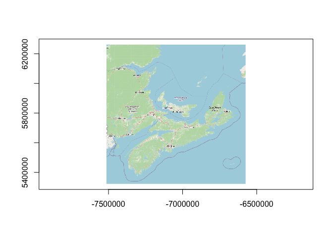

ROSM: Open Street Map tiles in R
================

<!-- README.md is generated from README.Rmd. Please edit that file -->
<!-- badges: start -->

[](https://app.codecov.io/gh/paleolimbot/rosm?branch=master)
<!-- badges: end -->

Download and plot [Open Street Map](https://www.openstreetmap.org/),
[Bing Maps](https://www.bing.com/maps), and other tiled map sources. A
previous version of this package provided an API for plotting base maps;
the new API is more low-level and covers tile math, URL generation, and
fetching tiles in parallel.

## Installation

The **rosm** package is [available on
CRAN](https://cran.r-project.org/package=rosm), and can be installed
using `install.packages("rosm")`.

## Example

``` r
library(rosm)

bounds <- wk::rct(
  -7476083, 5349058,
  -6594103, 6243203,
  crs = osm_crs_native()
)

(grd <- osm_raster(bounds, osm_url_spec_example()))
#> <wk_grd_rct [768 x 768] => [-7514066 5322463 -6574807 6261721] with crs=EPSG:3857>
#> List of 2
#>  $ data: 'nativeRaster' int [1:768, 1:768] -2108502 -2108502 -2108502 -2108502 -2108502 -2108502 -2108502 -2108502 -2108502 -2108502 ...
#>  $ bbox: wk_rct[1:1] [-7514066 5322463 -6574807 6261721]
#>  - attr(*, "class")= chr [1:2] "wk_grd_rct" "wk_grd"
plot(grd)
```


